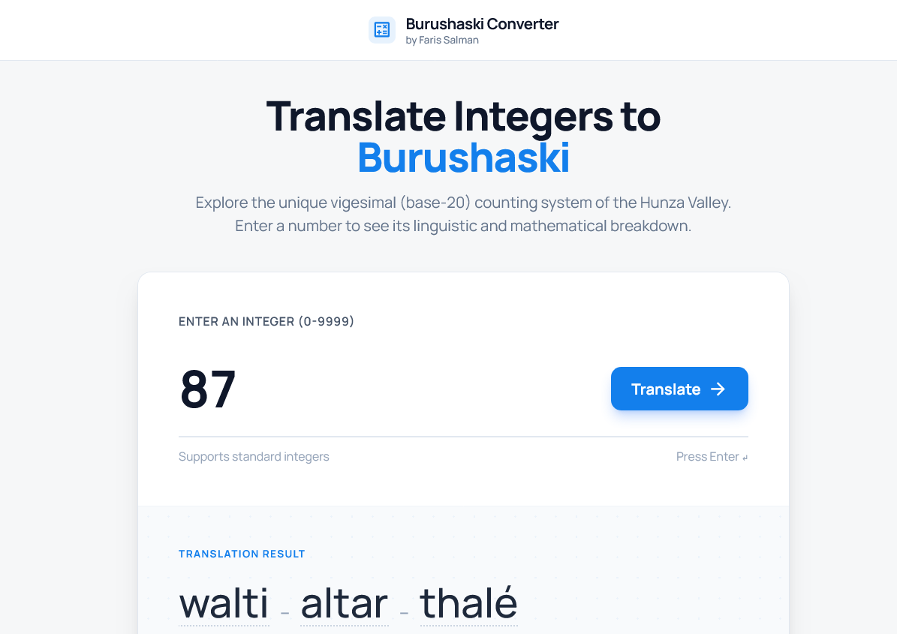
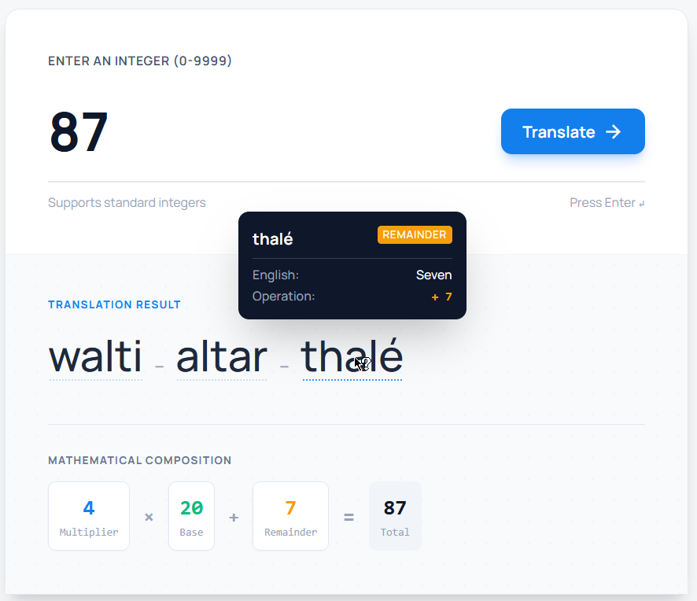

# Burushaski Number Converter

A modern, responsive web application for exploring and translating integers into the **Burushaski** language. Built with a focus on the unique vigesimal (base-20) counting system used in the Hunza Valley, this tool provides both linguistic translations and deep mathematical breakdowns of how the numbers are formed.

## ✨ Features

- **Accurate Base-20 Logic**: Translates any integer from `1` to `1,000,000` into grammatically correct Burushaski numerals.
- **Interactive Tooltips**: Hover over translated words to instantly view their English counterparts and specific mathematical operations.
- **Mathematical Visualizer**: Dynamically generates the underlying equation (e.g., `4 × 20 + 10 = 90`), color-coded by role (Multiplier, Base, Remainder).
- **Responsive Dashboard UI**: A sleek, accessible, modern interface built with **Tailwind CSS**. It looks perfect on both desktop and tightly constrained mobile devices.
- **Strictly Tokenized Data**: The core logic returns grammatical `Token` objects rather than simple strings, enabling a robust front-end experience.

## 📸 Screenshots

Here is a look at the Burushaski Converter in action:



*Modern Desktop View with the Mathematical Visualizer.*


*Hovering over a token reveals its translation and role.*


## 🚀 Live Demo

[https://farissalman12.github.io/burushashki-number-converter/](https://farissalman12.github.io/burushashki-number-converter/)

## 🛠️ Installation & Usage

This project runs entirely in the browser without any build processes or backend frameworks!

1. **Clone the repository:**
   ```bash
   git clone https://github.com/farissalman12/burushashki-number-converter.git
   ```
2. **Open the site:**
   Simply double-click the `index.html` file to open it in any modern browser. 

3. **Convert:**
   Type a number (e.g., `87`) and press **Enter**.

## 🧪 Testing

The core translation logic has been rigorously validated. The project uses the native Node `node:test` runner to guarantee data integrity.

To run the unit tests:
```bash
npm install
npm test
```
*Note: Make sure you have Node.js installed.*

## 📂 Project Structure

- `index.html`: The user interface and layout containing the Tailwind CDN integration.
- `converter.js`: The pure JavaScript core logic parser that yields grammatical tokens.
- `main.js`: The DOM manipulation script connecting the logic engine to the HTML interface.
- `converter.test.js`: Comprehensive strict unit testing against the tokenized outputs.

## 📄 License & Credits

This project was built by **Faris Salman**. It is open source and available under the MIT License.
